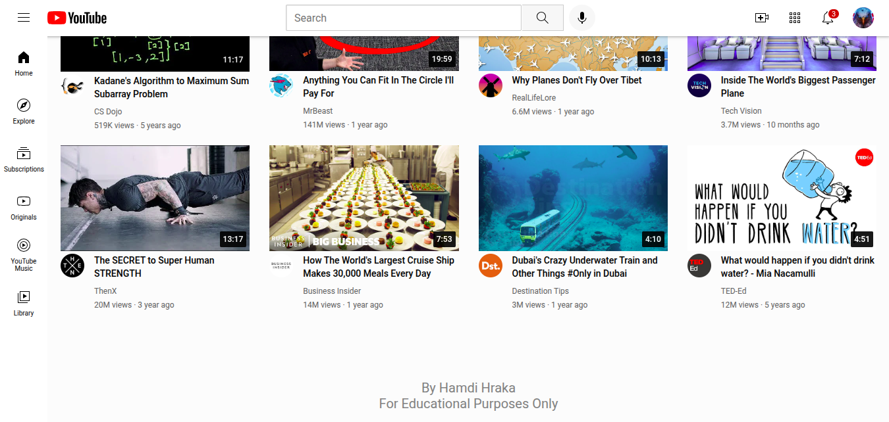

# YouTube Clone

This project is a simple YouTube homepage clone built with HTML and CSS. It demonstrates a responsive layout, modern UI elements, and grid-based video previews.

## Features

- **Header Navigation:** Includes YouTube logo, search bar, voice search, and quick access icons for upload, apps, notifications, and profile.
- **Sidebar:** Quick navigation buttons for Home, Explore, Subscriptions, Originals, YouTube Music, and Library.
- **Video Grid:** Responsive grid layout displaying video thumbnails, channel images, titles, and stats.
- **Tooltips:** Interactive tooltips on header icons for better user experience.
- **Responsive Design:** Adapts to different screen sizes using CSS media queries.
- **Footer:** Credits and educational disclaimer.

## Screenshot

Below is a preview of the homepage layout:

## How to Run

1. Clone or download the repository.
2. Open `youtube.html` in your browser.
3. All images and styles are included locally; no additional setup required.

## Credits

Created by Hamdi Hraka  
For Educational Purposes Only